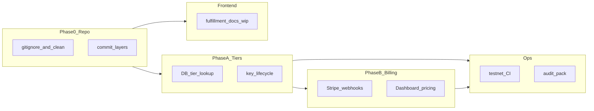

# Finish QCrypt RNG implementation (full roadmap)

## Current state (critical)

- **HEAD** is [947b94c](https://github.com/) on `main`; **large implementation exists only as modified + untracked files** in `/home/roc/quantumGlobalGroup/qcrypt-rng` (not on `origin/main`).
- **Phase A gap in code:** `[app/utils/rate_limiting.py](app/utils/rate_limiting.py)` still uses **MD5 hash pseudo-tiers** in `_get_tier()` (lines 110–125), while the `rate_limits` table already has a `tier` column—lookup is never used for limits.
- **Billing:** No `app/billing/` module yet; [docs/BUILD_MONETIZATION.md](docs/BUILD_MONETIZATION.md) describes required work.
- **Frontend:** [docs/frontend/MOCKUP_INVENTORY.md](docs/frontend/MOCKUP_INVENTORY.md) marks **Fulfillment**, `**/docs/api` (v3)**, and `**/docs` integration** as `wip` (routes exist under `[quantum-oracle-ui/src/app/(app)/](quantum-oracle-ui/src/app/(app)`/)).
- **Artifacts:** `quantum-oracle/contracts/node_modules/` is untracked; root `[.gitignore](.gitignore)` does **not** list `node_modules`—must fix before any commit.

---

## Phase 0 — Repository hygiene and landing the branch

1. **Ignore generated/vendor paths** (add to `.gitignore`): `node_modules/`, `quantum-oracle/contracts/node_modules/`, `.qwen/`, Python/HTML coverage outputs if not already; confirm `.env` remains ignored.
2. **Do not commit** contract `node_modules`; rely on `package-lock.json` + `npm ci` in deploy/CI (lockfile is already present as untracked).
3. **Commit strategy** (suggested order for reviewable history):
  - Backend: `app/blockchain/`, `app/monitoring/`, modified `app/api/v2/endpoints/*`, `app/quantum/*`, `app/config.py`, `app/utils/rate_limiting.py`, `app/main.py`
  - Tests: `tests/`, `pytest.ini`
  - Frontend: `quantum-oracle-ui/` (including `(app)/` routes and new components)
  - Docs: `docs/`**, moved `docs/PRODUCTION.md`, root pointer `PRODUCTION.md` if kept
  - Contracts/scripts: `quantum-oracle/contracts/` excluding `node_modules`
  - `scripts/start.py` (or replacement dev orchestrator), `docker-compose.yml`, `Makefile`, `requirements.txt`, `.env.example`
4. **Sanity gates** before pushing: `pytest`, `npm run build` in `quantum-oracle-ui/`, optional `npm run lint`.

---

## Phase A — Real tiers (foundation for billing)

**Files:** `[app/utils/rate_limiting.py](app/utils/rate_limiting.py)`, `[app/config.py](app/config.py)`, `[app/utils/middleware.py](app/utils/middleware.py)` if key validation touches tier.

1. **Replace `_get_tier()`**: `SELECT tier FROM rate_limits WHERE api_key = ?`; if row missing, use `'free'` (or reject when `REQUIRE_API_KEY`—match existing policy).
2. **On first insert** of an API key into `rate_limits`, persist `tier` (default `'free'`) instead of only `(api_key, reset_time)`.
3. **Backfill / admin path**: script or documented SQL to set `tier` for keys that map from `VALID_API_KEYS` / env—per [BUILD_MONETIZATION.md](docs/BUILD_MONETIZATION.md) acceptance criteria (two keys same tier → identical limits).
4. **Update** [docs/PRODUCTION.md](docs/PRODUCTION.md) and `[.env.example](.env.example)` for any new tier-related variables.

---

## Phase B — Stripe and subscription billing

**Reference:** [docs/BUILD_MONETIZATION.md](docs/BUILD_MONETIZATION.md), [docs/UPGRADE_ROADMAP.md](docs/UPGRADE_ROADMAP.md).

1. **New module** (e.g. `app/billing/`): Stripe webhook handler (`checkout.session.completed`, `customer.subscription.updated`/`deleted`) that updates `rate_limits.tier` or revokes keys; use **key hash** storage, never raw keys in DB.
2. **Secrets:** `STRIPE_SECRET_KEY`, `STRIPE_WEBHOOK_SECRET`, price IDs—document in `docs/PRODUCTION.md` and `.env.example`.
3. **Dashboard:** pricing / upgrade CTAs in `[quantum-oracle-ui/](quantum-oracle-ui/)` (new or existing pages under `(app)/`), linking to Checkout; optional usage display from existing monitoring/usage endpoints.
4. **Tests:** webhook signature verification (mocked), tier transitions in test DB.

---

## Phase C — Frontend: close mockup WIP

**Reference:** [docs/frontend/MOCKUP_INVENTORY.md](docs/frontend/MOCKUP_INVENTORY.md), [docs/frontend/MIGRATION_ORDER.md](docs/frontend/MIGRATION_ORDER.md).

| Area           | Intent                                                                                                                                                                                                                       |
| -------------- | ---------------------------------------------------------------------------------------------------------------------------------------------------------------------------------------------------------------------------- |
| `/fulfillment` | Finish `[FulfillmentWizard](quantum-oracle-ui/src/components/fulfillment/)` vs Stitch: single canonical flow, real API hooks, loading/error states aligned with backend fulfillment endpoints.                               |
| `/docs/api`    | Canonical **v3** terminal layout: replace placeholder `api.example.com` / read-only search with **real** `NEXT_PUBLIC_API_BASE_URL`, OpenAPI link or generated operation list, and copyable snippets that match live routes. |
| `/docs`        | Integration narrative: top bar + in-doc sidebar + TOC per design system.                                                                                                                                                     |

Cross-check `[docs/DASHBOARD_MONITORING_PLAN.md](docs/DASHBOARD_MONITORING_PLAN.md)` against UI so KEM/fulfillment panels stay consistent with `api.ts`.

---

## Phase D — Testnet, CI, monitoring

1. **Testnet:** Follow [docs/next-phase/TESTNET_DEPLOYMENT.md](docs/next-phase/TESTNET_DEPLOYMENT.md) and [docs/next-phase/TASK5_IMPLEMENTATION_SUMMARY.md](docs/next-phase/TASK5_IMPLEMENTATION_SUMMARY.md): fund deployer, run `deploy-all-testnets.js`, record contract addresses in env + docs (no secrets in git).
2. **CI:** Add pipeline (e.g. GitHub Actions): Python 3.9+ install from `requirements.txt`, `pytest`; Node 20+ `npm ci && npm run build` in `quantum-oracle-ui/`.
3. **Monitoring:** `[app/monitoring/](app/monitoring/)` and [docs/MONITORING_GUIDE.md](docs/MONITORING_GUIDE.md)—verify Prometheus endpoints and document scrape config in production runbook.

---

## Phase E — External audit preparation

1. Use [docs/next-phase/SECURITY_AUDIT_CHECKLIST.md](docs/next-phase/SECURITY_AUDIT_CHECKLIST.md) as the internal gate; add a short **auditor pack** (scope, threat model, endpoints list, contract addresses, dependency SBOM or `pip freeze` / `npm ls` outputs) under `docs/next-phase/` or `docs/archive/`.
2. **Stripe + key storage**: explicitly document KMS/HSM gap for production if keys are only env-based.
3. Schedule third-party review before mainnet; track findings separately from internal checklist.

---

## Definition of done (full roadmap)

- `main` pushed with all intended code/docs; no `node_modules` in repo; CI green.
- Tier limits driven by **stored tier**, not MD5; Stripe test flow upgrades/downgrades tier.
- Frontend mockup inventory: fulfillment + `/docs/api` + `/docs` marked `done` in MOCKUP_INVENTORY (or issue tracked with acceptance criteria).
- Testnet addresses documented; optional external audit engagement started with auditor pack delivered.

