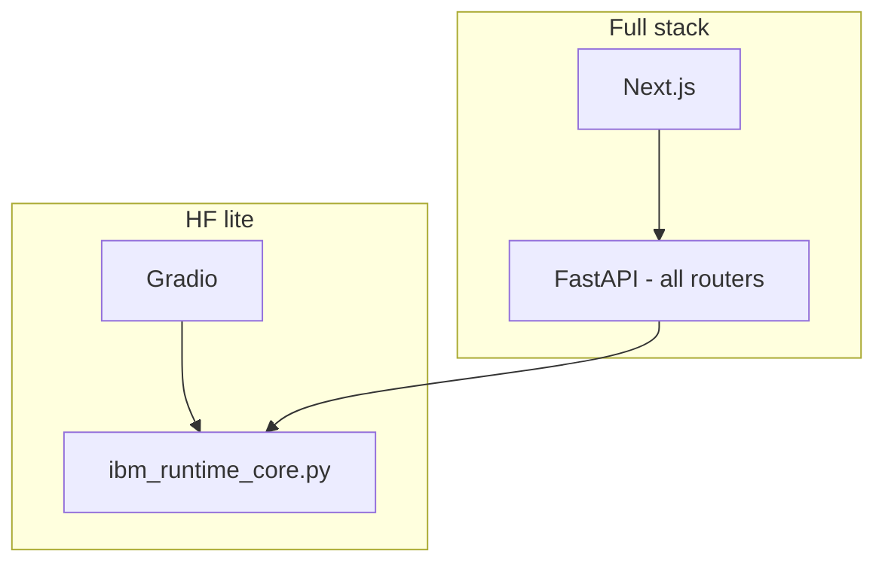

# Architecture: full app vs Hugging Face lite

## Full application

| Layer | Role |
|--------|------|
| **UI** | Next.js 16 (`quantum-oracle-ui`) — dashboard, research labs, PQC, oracle, etc. |
| **API** | FastAPI (`app/main.py`) — routers for generate, quantum, protect, PQC, blockchain, oracle, IBM Runtime, health, … |
| **Local** | `python scripts/start.py` (API + Next) or `python run_api.py` + `npm run dev` in `quantum-oracle-ui`. |
| **Deploy (example)** | Single container per `docs/FLY_IO.md` (Nginx + FastAPI + Next). |

## HF lite

| Layer | Role |
|--------|------|
| **UI** | Gradio (`hf_space/app.py`) — IBM Runtime tabs only (v1). |
| **Logic** | Python only; imports **`app.quantum.ibm_runtime_core`** (no duplicate IBM business logic in the Gradio file). |
| **Deploy** | Hugging Face Space (Gradio SDK); monorepo root as working directory so `app.*` imports resolve. |

## Shared core (principle)

- **IBM Runtime** execution, counts normalization, and proof digest live in **`app/quantum/ibm_runtime_core.py`**.
- **FastAPI** adds HTTP semantics (`HTTPException`, `ResponseStatus`).
- **Gradio** formats JSON for display.

This reduces drift between `/api/v2/ibm-runtime/*` and the Space.

## Diagram (conceptual)

## Related docs

- `docs/VENTURE.md` — product vs demo positioning.
- `docs/HF_GRADIO_LITE.md` — scope and roadmap for the Space.
- `hf_space/README.md` — run instructions.
