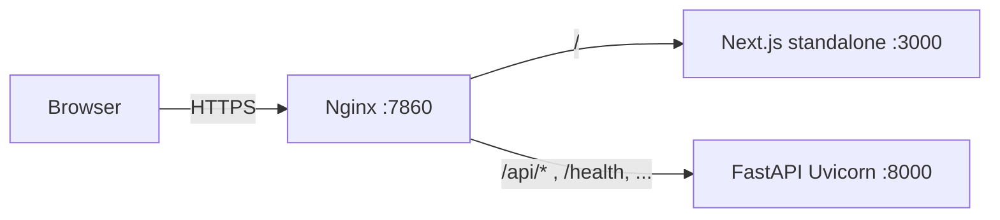

# Hosting architecture: UI + backend

This document describes how the **Next.js dashboard** and **FastAPI backend** fit together, which files and dependencies matter for deployment, and how traffic is routed in production.

For Fly.io–specific steps, see [`FLY_IO.md`](./FLY_IO.md). For the split between the full app and the Hugging Face Gradio slice, see [`ARCHITECTURE_SPLIT.md`](./ARCHITECTURE_SPLIT.md).

---

## 1. Mental model

| Layer | Technology | Location in repo |
|--------|------------|------------------|
| **HTTP API** | FastAPI + Uvicorn | `app/` (entry: `app.main:app`) |
| **Web UI** | Next.js 16 (App Router), **standalone** output | `quantum-oracle-ui/` |
| **Reverse proxy (production image)** | Nginx | `nginx.spaces.conf` + `start-spaces.sh` |

The browser talks to the **API under a single prefix**: by default **`/api/v2`** (see `API_PREFIX` in `app/config.py`). The Next app must know that base URL at **build time** for production bundles (`NEXT_PUBLIC_API_BASE_URL`).

---

## 2. Backend (FastAPI)

### Role

- Serves REST/OpenAPI endpoints, health checks, and optional Swagger/ReDoc (exact paths depend on whether you use the root app alone or behind Nginx; see §5).
- Configuration is environment-driven via **`app/config.py`** (`Settings`): CORS (`ALLOWED_ORIGINS`), `DATABASE_URL`, `REDIS_URL`, `SECRET_KEY`, quantum provider tokens, etc.

### Important paths

| Path | Purpose |
|------|---------|
| `app/main.py` | FastAPI app, middleware, router includes |
| `app/api/v2/` | Versioned API routes (generate, quantum, protect, PQC, blockchain, …) |
| `app/config.py` | Central settings; **must** align `ALLOWED_ORIGINS` with your deployed UI origin |
| `run_api.py` | Local dev: Uvicorn with port discovery (default **9878**) |
| `requirements.txt` | Python dependencies for the API |

### Runtime dependencies (Python)

Declared in **`requirements.txt`**. Highlights:

- **Core:** `fastapi`, `uvicorn[standard]`, `pydantic`, `pydantic-settings`
- **Crypto / PQC:** `cryptography`, `pycryptodome`, `liboqs-python` (optional in some Docker builds; PQC may fall back if liboqs is unavailable)
- **Quantum:** `qrisp`, `numpy`, `scipy`; optional `qiskit`, `qiskit-ibm-runtime` for IBM Runtime routes
- **Utilities:** `python-multipart`, `python-dotenv`, `loguru`, etc.

Install (typical local):

```bash
cd /path/to/qcrypt-rng
python -m venv .venv
. .venv/bin/activate
pip install -r requirements.txt
```

### Local ports

- **`API_PORT`** (default **9878**): used by `run_api.py` and by `scripts/start.py` when starting the API.

---

## 3. Frontend (Next.js)

### Role

- Operator/research UI: dashboards, docs pages, API-linked flows.
- Calls the backend using **`NEXT_PUBLIC_API_BASE_URL`**, which should end with **`/api/v2`** so client code matches the FastAPI prefix.

### Important paths

| Path | Purpose |
|------|---------|
| `quantum-oracle-ui/package.json` | Scripts and npm dependencies |
| `quantum-oracle-ui/next.config.ts` | **`output: 'standalone'`** — required for the production Docker image (`.next/standalone/server.js`) |
| `quantum-oracle-ui/src/` | App Router UI (routes, components, utilities) |
| `quantum-oracle-ui/find-port.js` | Dev: picks a free port starting at **3980** |
| `quantum-oracle-ui/env.example` | Documents `NEXT_PUBLIC_API_BASE_URL` and UI port notes |

### Runtime dependencies (Node)

From **`quantum-oracle-ui/package.json`**:

- **App:** `next` 16.x, `react` / `react-dom` 19.x, `lucide-react`
- **Dev/build:** `typescript`, `tailwindcss` 4, `eslint`, `@tailwindcss/postcss`, type packages

Install:

```bash
cd quantum-oracle-ui
npm ci   # or npm install
```

### Builds

- **Development:** `npm run dev` (port from `find-port.js`, default **3980**).
- **Production static/server bundle:** `npm run build` → outputs **standalone** server under `.next/standalone/` (used by the root `Dockerfile`).

### Environment variables (UI)

| Variable | When | Purpose |
|----------|------|-----------|
| `NEXT_PUBLIC_API_BASE_URL` | Build (production) | Full URL to API **including** `/api/v2`, e.g. `https://your-domain.example/api/v2` |
| `PORT` | Runtime (Node) | Port for `next start` / standalone server (production image sets **3000** behind Nginx) |

Copy or merge from **`quantum-oracle-ui/env.example`** into `.env.local` for local overrides.

### CORS

The API must list the UI origin in **`ALLOWED_ORIGINS`** (see `app/config.py`). For local dev, defaults already include common ports such as **3980**.

---

## 4. Unified local startup

From the **repository root**:

```bash
.venv/bin/python scripts/start.py
```

This starts:

- Uvicorn for **`app.main:app`** with reload, on the chosen API port (default **9878**).
- **`npm run dev`** in `quantum-oracle-ui` with `NEXT_PUBLIC_API_BASE_URL=http://localhost:<api_port>/api/v2`.

Alternatively, run API and UI in two terminals: `python run_api.py` and `cd quantum-oracle-ui && npm run dev`.

---

## 5. Production: single container (Nginx + FastAPI + Next)

The root **`Dockerfile`** defines the **recommended** way to host **both** UI and API behind one hostname:

1. **Build stage:** install Python deps from `requirements.txt`, then **`npm ci` / `npm install`** and **`npm run build`** inside `quantum-oracle-ui` with **`NEXT_PUBLIC_API_BASE_URL`** as a **build-arg** (same-origin pattern: `https://<your-host>/api/v2`).
2. **Runtime:** `start-spaces.sh` starts:
   - **FastAPI** on `127.0.0.1:8000` (`uvicorn app.main:app`)
   - **Next.js standalone** on `127.0.0.1:3000` (`node .next/standalone/server.js`)
   - **Nginx** in the foreground on **7860** (public port in the image)

**`nginx.spaces.conf`** routes:

- `/api/`, `/health`, `/openapi.json`, `/redoc`, `/swagger` → FastAPI
- `/` → Next.js

So the **browser** only talks to **one origin** (e.g. `https://app.example.com`); the API path is still under **`/api/...`** (your FastAPI app uses the **`/api/v2`** prefix for versioned routes).

Files you need for this layout:

- `Dockerfile`, `nginx.spaces.conf`, `start-spaces.sh`
- `requirements.txt`, `app/`, `run_api.py` (image copies `app/` and uses uvicorn directly)
- Full `quantum-oracle-ui/` tree for the Next build

See **`docs/FLY_IO.md`** for `fly.toml` (`internal_port = 7860`), build args, and secrets.

---

## 6. Docker Compose (root `docker-compose.yml`)

The bundled **`docker-compose.yml`** focuses on the **API** service (plus Postgres and Redis). It does **not** build the Next.js UI into that service by default; comments in the file point to running the UI via **`npm run dev`** or a separate production build.

If you need **both** API and UI in one stack, either:

- Use the **single-container** image from the root `Dockerfile`, or  
- Add a **second service** that builds/runs `quantum-oracle-ui` with the correct `NEXT_PUBLIC_API_BASE_URL` pointing at the API service URL.

---

## 7. Checklist for a new host

1. **Python:** Install from `requirements.txt`; set `ENVIRONMENT`, `SECRET_KEY`, `ALLOWED_ORIGINS`, and any DB/Redis URLs your deployment uses.
2. **Next.js:** Run `npm run build` with **`NEXT_PUBLIC_API_BASE_URL`** set to your public API base (**must** include `/api/v2`).
3. **Routing:** Either terminate TLS at your platform and proxy to Nginx **7860** (single image), or split UI and API on two hostnames and configure CORS + `NEXT_PUBLIC_API_BASE_URL` accordingly.
4. **Health:** Expose **`/health`** through your proxy for load balancer checks (see `nginx.spaces.conf` and `docs/FLY_IO.md`).

---

## 8. Related documentation

| Doc | Topic |
|-----|--------|
| [`FLY_IO.md`](./FLY_IO.md) | Fly.io deploy, `NEXT_PUBLIC_API_BASE_URL`, `internal_port`, secrets |
| [`FLY_IO_FILES.md`](./FLY_IO_FILES.md) | Checklist of repo files and Fly config for hosting on Fly.io |
| [`../fly.toml.example`](../fly.toml.example) | Template `fly.toml` (merge after `fly launch`) |
| [`ARCHITECTURE_SPLIT.md`](./ARCHITECTURE_SPLIT.md) | Full stack vs Hugging Face Gradio lite |
| [`HF_GRADIO_LITE.md`](./HF_GRADIO_LITE.md) | Optional Gradio demo (not the main Next UI) |
| `quantum-oracle-ui/env.example` | UI env template |

---

## 9. Diagram (single-container production)



This matches the layout implemented by **`nginx.spaces.conf`** and **`start-spaces.sh`**.
